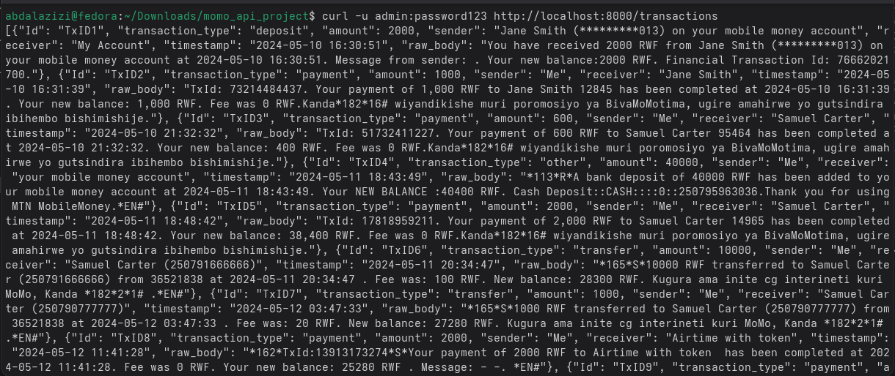

# MoMo SMS Transactions API (Sample Project)

## Structure
- api/server.py - simple REST API with Basic Authentication
- dsa/parse_xml.py - XML parsing utility
- dsa/dsa_compare.py - DSA measurement (linear vs dict lookup) using sample XML
- docs/api_docs.md - API documentation
- dsa/modified_sms_sample.xml - sample XML with 24 records
- dsa/modified_sms_sample.json - parsed JSON used by API

## Setup & Run (local)
1. Clone or download the project to your machine.
2. Put your `modified_sms_v2.xml` in `dsa/` and optionally overwrite `modified_sms_sample.json` by running:
   ```bash
   python dsa/parse_xml.py dsa/modified_sms_v2.xml > dsa/modified_sms_v2.json
   ```
3. Start the API server:
   ```bash
   python api/server.py
   ```
   The server listens on port 8000 and uses Basic Auth (admin:password123).

## Testing (curl examples)
- List transactions:
  ```bash
  curl -u admin:password123 http://localhost:8000/transactions
  ```
- Unauthorized request:
  ```bash
  curl http://localhost:8000/transactions
  ```
- Add transaction:
  ```bash
  curl -u admin:password123 -H "Content-Type: application/json" -d '{'''type''':'''PAYMENT''','''amount''':5000,'''sender''':'''+2507...''','''receiver''':'''+2507...''','''timestamp''':'''2025-09-01T10:00:00''','''note''':'''test'''}' http://localhost:8000/transactions
  ```

## DSA Comparison
Run:
```bash
python dsa/dsa_compare.py
```
This will print timing comparisons for linear search vs dictionary lookup on sample data.

## Screenshots

### Get All Transactions


### Bulk Request


## Project Report

A detailed report in PDF format is available here: [Project Report](report.pdf).
